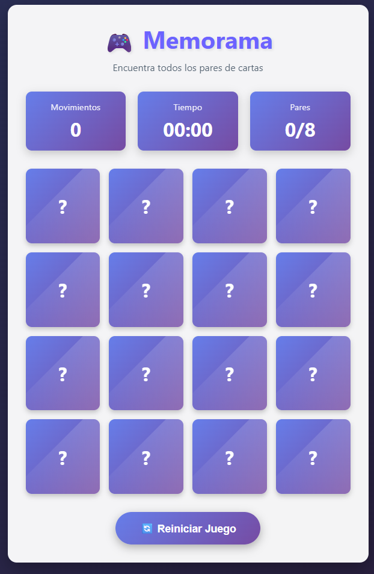

# 🎮 Memorama - Memory Card Game

Juego interactivo de memoria desarrollado con HTML, CSS y JavaScript vanilla. Encuentra todos los pares de cartas en el menor tiempo y movimientos posibles.


## ✨ Características

- 🎴 **16 cartas** con 8 pares de emojis únicos
- 📊 **Sistema de estadísticas** en tiempo real
- ⏱️ **Cronómetro** que inicia con el primer movimiento
- 🎯 **Contador de movimientos** para seguir tu progreso
- 🏆 **Modal de victoria** con resumen de estadísticas
- 📱 **Diseño responsive** adaptado a todos los dispositivos
- ✨ **Efecto shimmer** en las cartas para un toque visual elegante
- 🎨 **Interfaz moderna** con gradientes y animaciones suaves

## 📸 Capturas de Pantalla

### Vista Principal



## 🛠️ Tecnologías Utilizadas

- **HTML5** - Estructura semántica del juego
- **CSS3** - Estilos, animaciones y diseño responsive
  - CSS Grid para el layout de cartas
  - Flexbox para alineación de elementos
  - Transformaciones 3D para el volteo de cartas
  - Animaciones con @keyframes
  - Variables CSS para temas personalizables
- **JavaScript ES6+** - Lógica del juego
  - Manipulación del DOM
  - Event Listeners
  - Algoritmo Fisher-Yates para mezclar cartas
  - setInterval para el cronómetro
  - Destructuring y Spread Operator

## 🧠 Conceptos Técnicos Implementados

### HTML

- Estructura semántica con `<header>`, `<section>`, `<div>`
- Uso de `data-attributes` para almacenar información de las cartas
- Modal implementado con HTML puro

### CSS

```css
/* Variables CSS para temas personalizables */
:root {
  --primary-color: #6c63ff;
  --card-back: linear-gradient(135deg, #667eea 0%, #764ba2 100%);
}

/* CSS Grid para el tablero */
.game-board {
  display: grid;
  grid-template-columns: repeat(4, 1fr);
  gap: 15px;
}

/* Transformaciones 3D para volteo */
.card__inner {
  transform-style: preserve-3d;
  transition: transform 0.6s;
}

.card.flipped .card__inner {
  transform: rotateY(180deg);
}
```

### JavaScript

#### Algoritmo Fisher-Yates para mezclar cartas

```javascript
function shuffleArray(array) {
  const shuffled = [...array];
  for (let i = shuffled.length - 1; i > 0; i--) {
    const j = Math.floor(Math.random() * (i + 1));
    [shuffled[i], shuffled[j]] = [shuffled[j], shuffled[i]];
  }
  return shuffled;
}
```

#### Gestión de estado del juego

```javascript
let gameState = {
  cards: [],
  flippedCards: [],
  matchedPairs: 0,
  moves: 0,
  timeElapsed: 0,
  timerInterval: null,
  isProcessing: false,
};
```

## 🎨 Funcionalidades

### Sistema de Estadísticas

- **Movimientos**: Cuenta cada par de cartas volteadas
- **Tiempo**: Cronómetro que muestra MM:SS
- **Pares**: Muestra pares encontrados de 8 totales

### Validaciones

- No se pueden voltear más de 2 cartas simultáneamente
- Las cartas coincidentes no se pueden volver a seleccionar
- Bloqueo temporal mientras se procesan las cartas

## 🎨 Personalización

### Cambiar los Emojis

En `script.js`, modifica el array de emojis:

```javascript
const gameConfig = {
  emojis: ["🎮", "🎯", "🎲", "🎪", "🎨", "🎭", "🎸", "🎺"],
  // Cambia estos emojis por los que prefieras
};
```

### Cambiar los Colores

En `style.css`, modifica las variables CSS:

```css
:root {
  --primary-color: #6c63ff; /* Color principal */
  --secondary-color: #ff6584; /* Color secundario */
  --success-color: #4caf50; /* Color de éxito */
  --background: linear-gradient(135deg, #2a335c 0%, #281a36 100%);
}
```

## 🤝 Contribuciones

Las contribuciones son bienvenidas. Para cambios importantes:

1. Fork el proyecto
2. Crea una rama para tu feature (`git checkout -b feature/AmazingFeature`)
3. Commit tus cambios (`git commit -m 'Add: nueva característica'`)
4. Push a la rama (`git push origin feature/AmazingFeature`)
5. Abre un Pull Request

## 🙏 Agradecimientos

- Inspirado en el clásico juego de memoria
- Desarrollado como proyecto integrador del curso de Fundamentos de Desarrollo Web Frontend
- Fundación Universitaria de Popayán - Programa Ingeniería de Sistemas

---

⭐️ Si te gustó este proyecto, ¡dale una estrella en GitHub!

**[⬆ Volver arriba](#-memorama---memory-card-game)**
